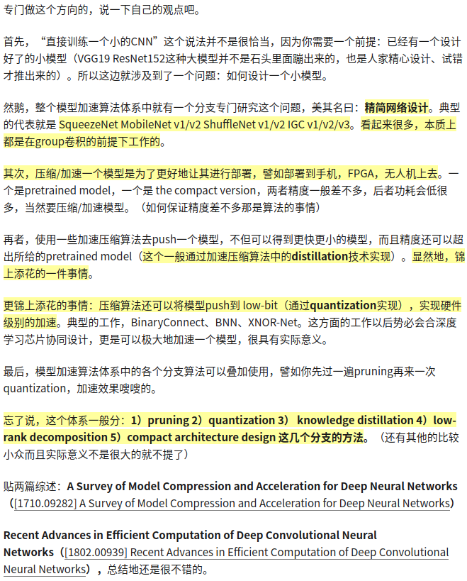
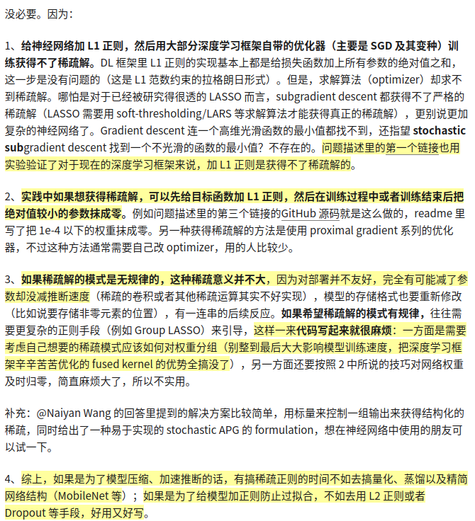

模型加速算法体系主要有5个方向:

1. pruning(会用就好)
2. quantization(值得研究)
3. knowledge distillation(值得研究)
4. low-rank decomposition(暂时不考虑)
5. compact architecture design(值得研究)

压缩/加速一个模型是为了更好的让其进行部署，譬如部署到手机，FPGA，无人机上去

知乎上有个不错的回答，原问题是: [为什么要压缩模型, 而不是直接训练一个小的CNN](https://www.zhihu.com/question/303922732/answer/548012918)，看下图:

这里有个观点，所以我觉得剪枝技术就到这儿吧(当然也有rethinking-network-pruning论文的影响，所以我对它的观点是，用来获得稀疏网络，压缩的时候可以减小模型体积，至于推断的话，还得看硬件支不支持稀疏矩阵计算加速)，我打算会使用工具库就好，理论研究不打算进行，知乎上的原问题是: [深度学习训练中是否有必要使用L1获得稀疏解](https://www.zhihu.com/question/51822759/answer/675969996)

下图是别人的观点:

# 剪枝笔记

一个典型的network pruning过程, 有3个stage:

1. train a large, over-parameterized model
2. prune the trained large model according to a certain criterion
3. fine-tune the pruned model to regain the lost performance

剪枝主要有两种:

1. 非结构化剪枝，最主要的是individual weight pruning. 但是非结构化的剪枝会导致权重矩阵稀疏，如果没有专门的硬件/库，就不能压缩和加速计算
2. 结构化剪枝是在chennel或者layer层次上剪枝。channel pruning是最流行的结构化剪枝，因为它在最细粒度的level上运行

自动剪枝算法的价值可以被视为搜索高效的架构(看能不能和NAS结合)

假如每一层剪枝比例不一定，比如提出一种全局的评价指标，然后剪枝，那剪枝很有存在的必要

# 探索Pytorch官网时发现的有意思的东西

[Pytorch Hub, SSD By NVIDIA](https://pytorch.org/hub/nvidia_deeplearningexamples_ssd/),

[Albumentations](https://github.com/albumentations-team/albumentations),fast image augmentation library and easy to use wrapper around other libraries

[Detectron2](https://github.com/facebookresearch/detectron2),Detectron2 is FAIR's next_generation platform for object detection and segmentaion

[fast.ai](https://docs.fast.ai/)

[glow](https://github.com/pytorch/glow),compiler for neural network hardware accelerators

[horovod](https://github.com/horovod/horovod),Distributed training framework for Tensorflow, Keras, PyTorch, and Apache MXNet

[optuna](https://github.com/optuna/optuna),A hyperparameter optimization framework

# rethinking-network-pruning仓库 ICLR2019

we evaluate the following seven pruning methods

1. L1-norm based channel pruning
2. ThiNet
3. Regression based feature reconstruction
4. Network Slimming
5. Sparse Structure Selection
6. Soft filter pruning
7. Unstructured weight-level pruning

the first six is structured while the last one is unstructured(or sparse)

For CIFAR, our code is based on [pytorch-classification](https://github.com/bearpaw/pytorch-classification) and [network-slimming](https://github.com/Eric-mingjie/network-slimming)

对于pytorch-classification来说，跑过vgg19bn(92.75%), resnet_110(94.11%), resnetxt_29(95.66), densenet_100(95.23), preresnet_110(94.09)，基本上和作者跑出来的结果差不多

对于network-slimming来说，跑过vgg19, resnet164, densenet40，不过确实会出现下面的一种情况，剪枝率为60%的时候，resnet164出现错误

our experiment environment is python3.6 & PyTorch 0.3.1

[该算法的论文 Learning Efficient Convolutional Networks through Network Slimming](https://arxiv.org/abs/1708.06519)

[YOLOv3-model-pruning](https://github.com/Lam1360/YOLOv3-model-pruning)

作者基于最近的相关工作和剪枝算法，提出了不同甚至有点惊人的网络剪枝方法的特性: 使用继承权重微调修剪后的模型并不比从头开始训练更好

# network-slimming仓库 ICCV 2017

the code is based on [pytorch-slimming](https://github.com/foolwood/pytorch-slimming), we add support for ResNet and DenseNet

## Dependencies

torch 0.3.1      torchvision 0.2.0

搜一下train with sparsity是什么

Note: For results of pruning 60% of the channels for resnet164-cifar100, in this implementation, sometimes some layers are all pruned and there would be error. However, we also provide a mask implementation where we apply a mask to the scaling factor in BN layer. For [mask implementation](https://github.com/Eric-mingjie/network-slimming/tree/master/mask-impl), when pruning 60% of the channels in resnet164-cifar100, we can also train the pruned network