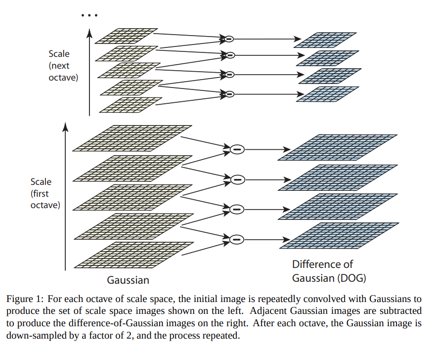
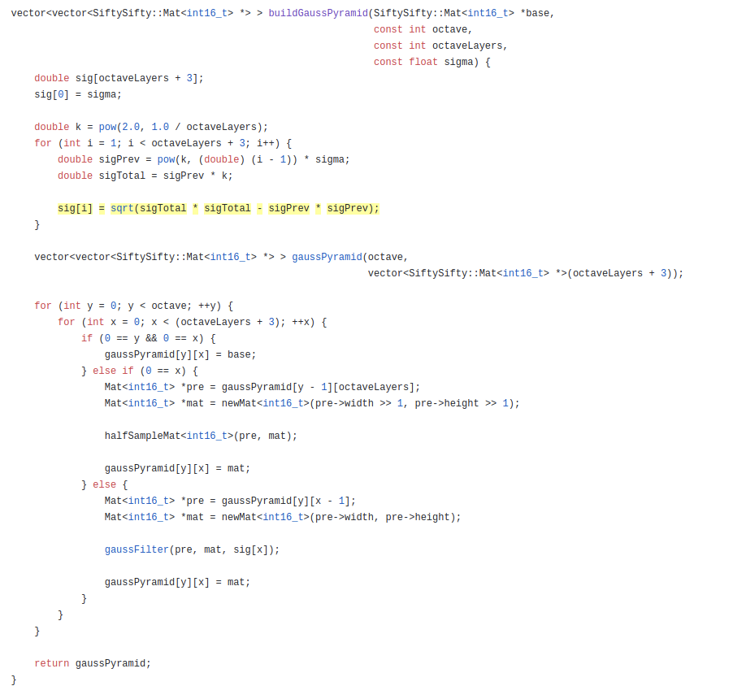
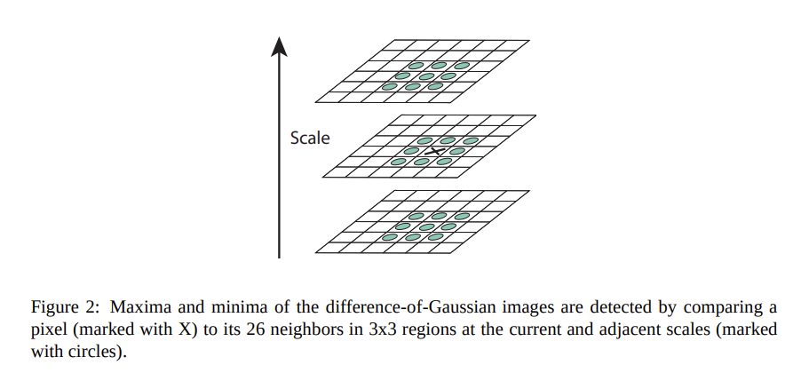
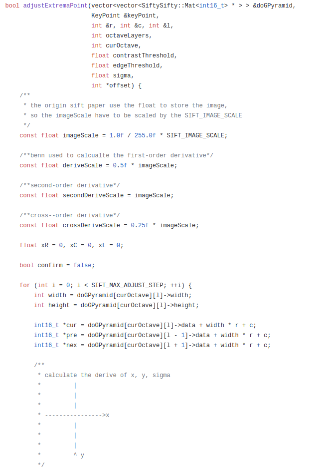
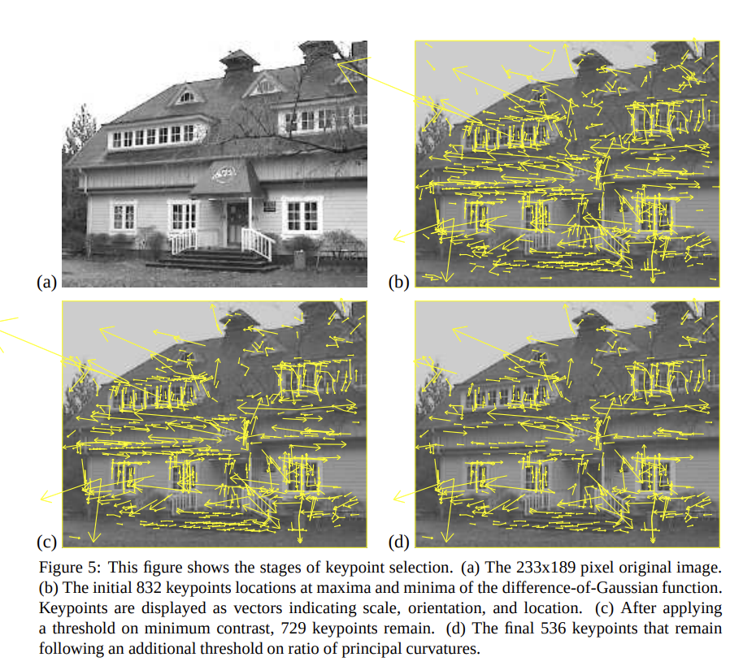
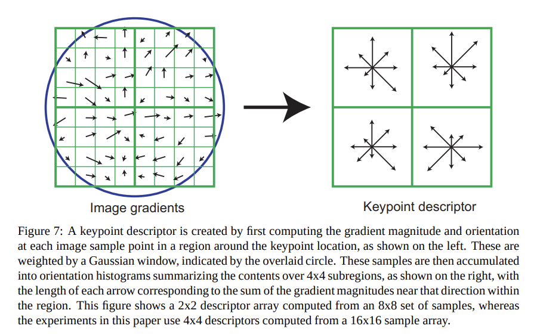
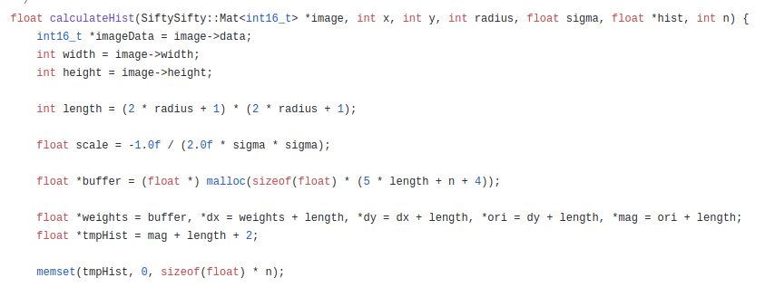
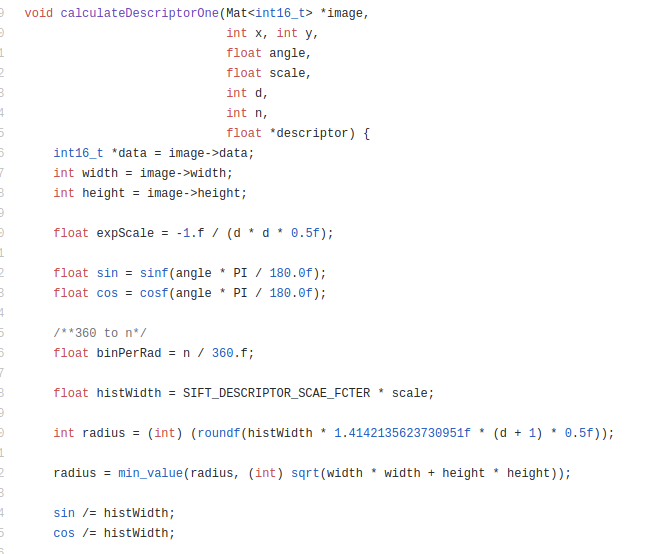

求极值点:DOG+Taylor,用连续拟合离散,做到精确定位关键点,参考文章:[SIFT算法中DoG特征点的修正](https://www.cnblogs.com/pakfahome/p/3598983.html),

Sigma怎么算:[siftysifty.cpp](https://github.com/amazingyyc/SiftySifty/blob/master/src/siftysifty.cpp),

为什么用差分代替二阶导:[SIFT特征提取中用差分代替求偏导](https://blog.csdn.net/lihuajie1003/article/details/41379405),

[SIFT特征点算法源码分析(opencv)](https://blog.csdn.net/NewThinker_wei/article/details/46707729),

[SIFT descriptor](https://zhuanlan.zhihu.com/p/43543527#),

[文章里的代码参考来源](https://github.com/amazingyyc/SiftySifty/blob/master/src/siftysifty.cpp),

先说SIFT的过程:

1. 生成图像的尺寸空间
2. 检测尺寸空间的极值, 然后使用泰勒展开精确定位关键点
3. 使用一些方法筛选关键点
4. 方向赋值,用于计算图像直方图
5. 计算关键点附近16x16大小的梯度大小和方向
6. 构成关键点4x4大小8个bin的descriptor,这个就是128维特征向量

## 生成图像的尺寸空间

​																			上图解释了DOG和尺寸空间

具体的话,可以看看代码:

​														上图是如何构建高斯金字塔的代码,其中提到了sigma和k两个参数

## 检测尺寸空间的极值, 然后使用泰勒展开精确定位关键点

上图解释了如何检测极值点,不过是离散方式的,为了更精确的定位极值点,我们需要用到泰勒展开,对离散的极值点进行拟合,具体的话可以看[这篇文章](https://www.cnblogs.com/pakfahome/p/3598983.html)

代码的话看下图:

上图的代码,包含了泰勒展开拟合DOG,以及通过低对比度等方式筛选掉一些不合格的关键点

​															上图是经过筛选之后的关键点效果图

## 方向赋值,也就是计算128维特征向量

​															上图是关键点的特征向量计算方式

首先要计算方向直方图,下方是代码:

然后是计算128维的特征向量,下方是代码:

关于里面的参数,n表示的是统计n个梯度方向的直方图, d代表的是上面说的16x16的意思

