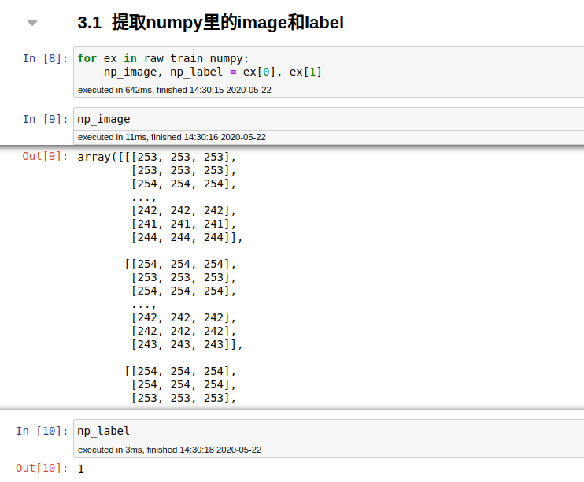
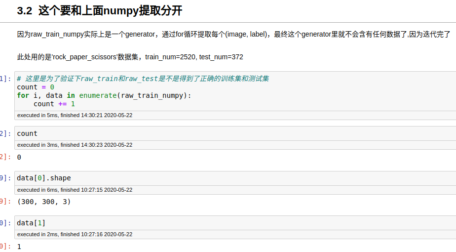
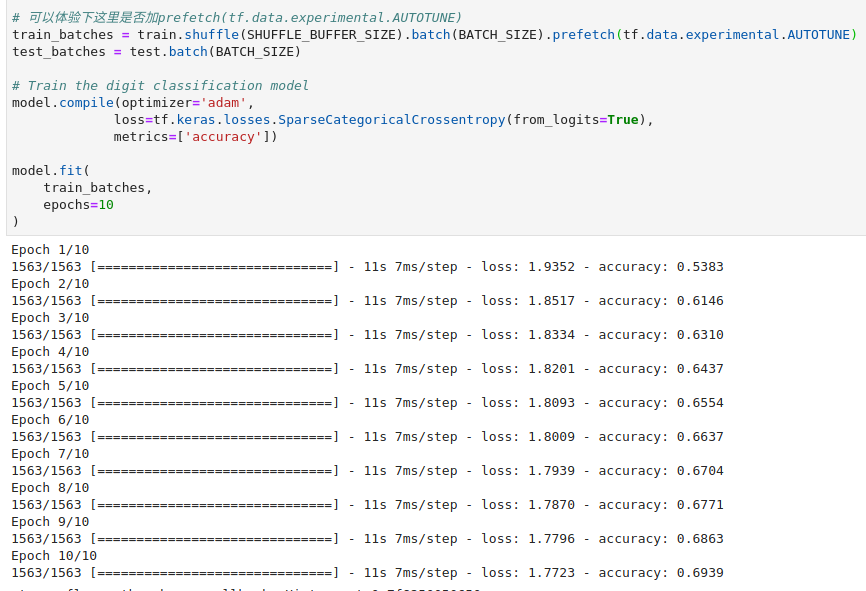
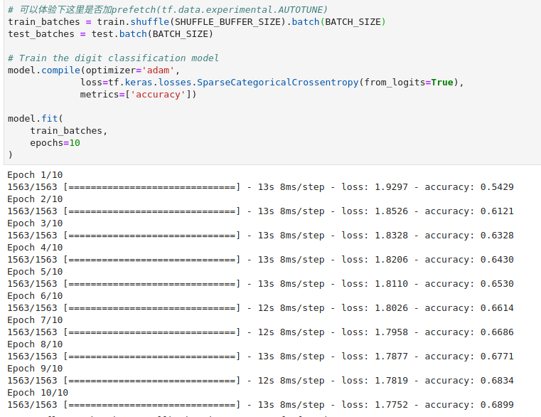

所以数据读取环节其实也是比较重要的, 对训练速度是有影响的

我们先来看看如何训练一个模型，我把它大致分为了三个阶段，就是上图所说的Data Pipeline，Model Build，Model train and eval，这节课我们要讲的就是**Data Pipeline**，因为课程采用的框架是Tensorflow2.0版本，所以为了新手上路方便，我们此处采用**Tensorflow Datasets**来完成Data Pipeline任务

上图是Tensorflow内置的数据集，其实种类不少了，我收集了一些有意思的分类数据集，感兴趣的可以看看下面这个表，对于数据集属于哪方面，我描述的比较粗糙，具体的话同学们可以去查一下

## 有意思的分类数据集

| 数据集属于哪方面           | 数据集名称          | 数据集大小 | 数据集类别数 |
| -------------------------- | ------------------- | ---------- | ------------ |
| 汽车牌子分类(属于类内分类) | cars196             | 1.82GiB    | 196          |
| 远近正负反馈分类           | dmlab               | 2.81GiB    | 6            |
| 不同食物分类               | food101             | 4.65GiB    | 101          |
| 类似于ImageNet数据集       | i_naturalist2017    | 237.35GiB  | 5089         |
| 医学类数据集               | patch_camelyon      | 7.48GiB    | 2            |
| 场景分类                   | places365_small     | 29.27GiB   | 365          |
| 植物病例分类               | plant_leaves        | 6.81GiB    | 22           |
| 贴图分类                   | quickdraw_bitmap    | 36.82GiB   | 345          |
| 手势分类                   | rock_paper_scissors | 219.53MiB  | 3            |

接下来我们直接看程序，学习如何加载训练模型所需要的训练集和测试集

## 解释tfds.load()

对于tfds.load()函数，我觉得有必要解释下常用的参数，常用的参数我highlight了一下

name: 数据集的名称，比如'cifar10', 'rock_paper_scissors'

split: 对于这个的话，我们来看下面这个图，所以此处应该填写['test', 'train']，注意对应上就行

data_dir: 这个参数一般默认就可以，下载和读取数据的默认地址是"~/tensorflow_datasets"，因为我用的是Linux，这里我通过操作直观的解释下

batch_size: 这个参数我想大家都知道了，不多解释

download: 这个字面解释的很到位了

as_supervised: 如果设置为True，那么返回的是一个tuple, (input, label)，可以对应下代码理解

with_info: 返回数据集的一些信息，就是metadata里的信息，我们可以看一下下面这个图，with_info是否为True的两种写法

我们知道数据存在的方式主要有两种，numpy array这个在matplotlib等函数库中是用于做imshow的，另外一种tensor主要用于tensorflow等框架进行训练用的

## 下面两个图解释了转化成numpy generator之后如何取出数据

上图中count=0是因为在3.1中我们已经迭代完raw_train_numpy里的数据了，所以3.2这里再次迭代统计数据个数的时候，结果为0，这个还可以和OptionsDataset对比下

## 加了prefetch可以加快训练速度(IO方面优化)

**加了prefetch之后的训练速度**

**加了prefetch之后的CPU运行状态**

**加了prefetch和cache之后CPU运行状态**

如果电脑的CPU核心数不多，但是内存多，我建议使用cache，以对数据进行缓存，提高训练速度(解决CPU造成的瓶颈问题)

**不加prefetch的时候的训练速度**

