所以数据读取环节其实也是比较重要的, 对训练速度是有影响的

我们先来看看如何训练一个模型，我把它大致分为了三个阶段，就是上图所说的Data Pipeline，Model Build，Model train and eval，这节课我们要讲的就是**Data Pipeline**，因为课程采用的框架是Tensorflow2.0版本，所以为了新手上路方便，我们此处采用**Tensorflow Datasets**来完成Data Pipeline任务

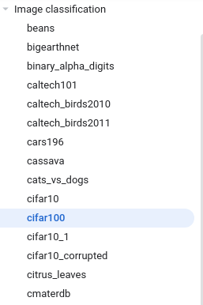

上图是Tensorflow内置的数据集，其实种类不少了，我收集了一些有意思的分类数据集，感兴趣的可以看看下面这个表，对于数据集属于哪方面，我描述的比较粗糙，具体的话同学们可以去查一下

## 有意思的分类数据集

| 数据集属于哪方面           | 数据集名称          | 数据集大小 | 数据集类别数 |
| -------------------------- | ------------------- | ---------- | ------------ |
| 汽车牌子分类(属于类内分类) | cars196             | 1.82GiB    | 196          |
| 远近正负反馈分类           | dmlab               | 2.81GiB    | 6            |
| 不同食物分类               | food101             | 4.65GiB    | 101          |
| 类似于ImageNet数据集       | i_naturalist2017    | 237.35GiB  | 5089         |
| 医学类数据集               | patch_camelyon      | 7.48GiB    | 2            |
| 场景分类                   | places365_small     | 29.27GiB   | 365          |
| 植物病例分类               | plant_leaves        | 6.81GiB    | 22           |
| 手势分类                   | rock_paper_scissors | 219.53MiB  | 3            |

接下来我们直接看程序，学习如何加载训练模型所需要的训练集和测试集，**想把这里的数据集都测一遍，还没做**

## 解释tfds.load()

对于tfds.load()函数，我觉得有必要解释下常用的参数，常用的参数我highlight了一下

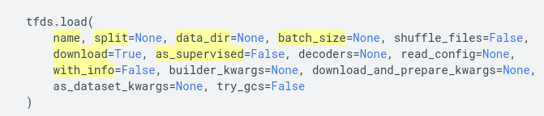

name: 数据集的名称，比如'cifar10', 'rock_paper_scissors'

split: 对于这个的话，我们来看下面这个图，所以此处应该填写['test', 'train']，注意对应上就行

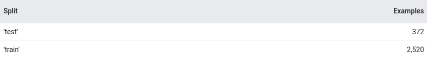

data_dir: 这个参数一般默认就可以，下载和读取数据的默认地址是"~/tensorflow_datasets"，因为我用的是Linux，这里我通过操作直观的解释下

batch_size: 这个参数我想大家都知道了，不多解释

download: 这个字面解释的很到位了

as_supervised: 如果设置为True，那么返回的是一个tuple, (input, label)，可以对应下代码理解

with_info: 返回数据集的一些信息，就是metadata里的信息，我们可以看一下下面这个图，with_info是否为True的两种写法

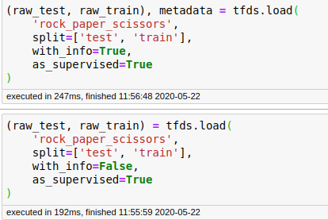

我们知道数据存在的方式主要有两种，numpy array这个在matplotlib等函数库中是用于做imshow的，另外一种tensor主要用于tensorflow等框架进行训练用的

## 下面两个图解释了转化成numpy generator之后如何取出数据

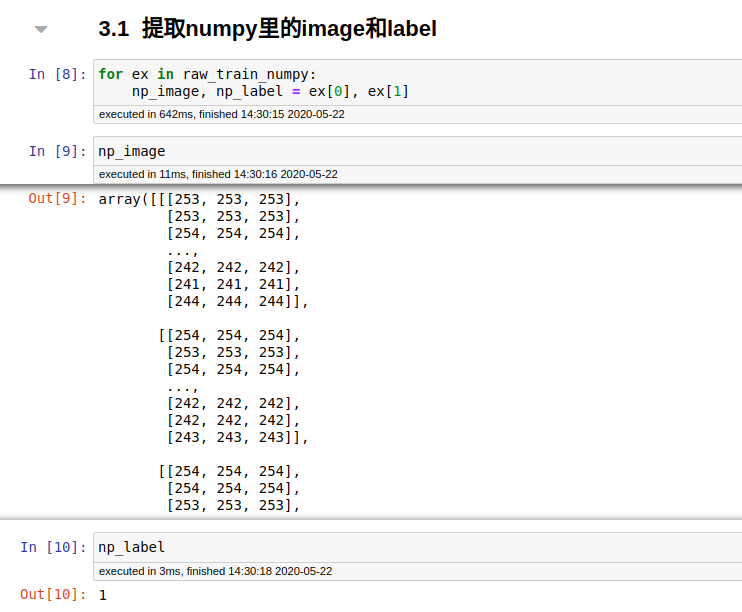

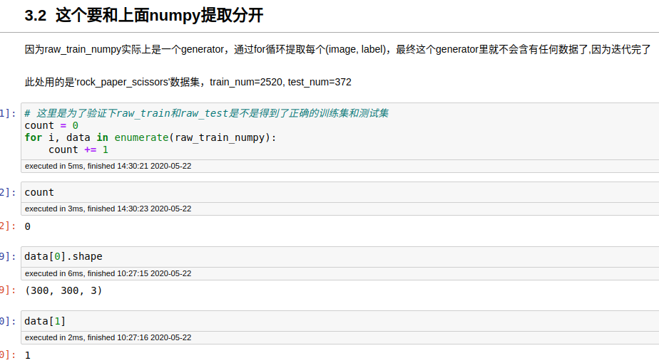

上图中count=0是因为在3.1中我们已经迭代完raw_train_numpy里的数据了，所以3.2这里再次迭代统计数据个数的时候，结果为0，这个还可以和OptionsDataset对比下

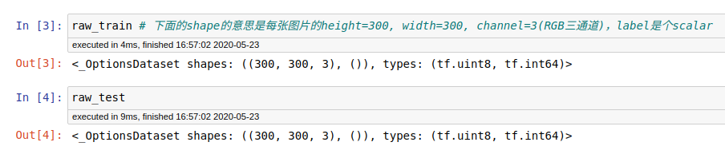

## 加了prefetch可以加快训练速度(IO方面优化)

**加了prefetch之后的训练速度**

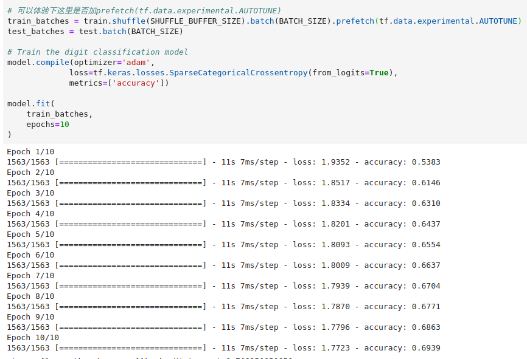

**加了prefetch之后的CPU运行状态**

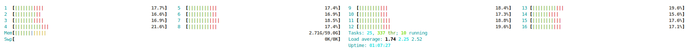

**加了prefetch和cache之后CPU运行状态**

如果电脑的CPU核心数不多，但是内存多，我建议使用cache，以对数据进行缓存，提高训练速度(解决CPU造成的瓶颈问题)

**不加prefetch的时候的训练速度**

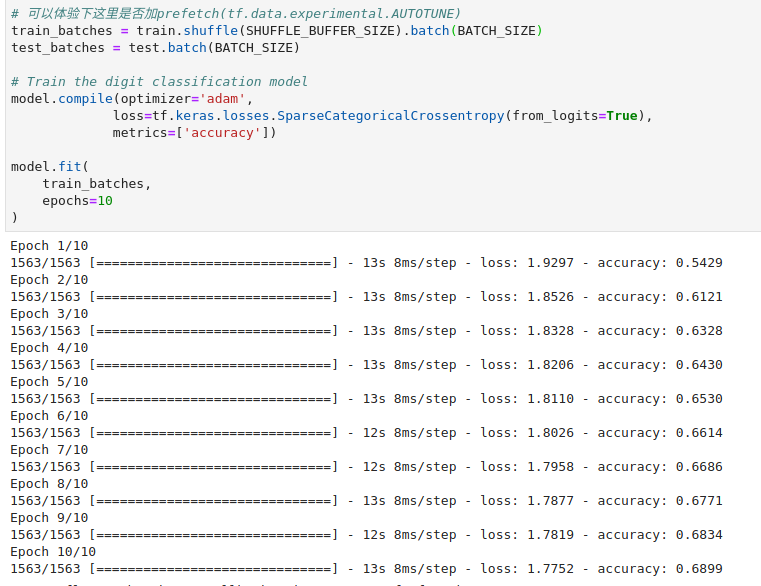

## 对模型进行剪枝

模型剪枝属于模型优化中的重要技术之一

当前比较主流的几个模型优化工具有:

+ Tensorflow Model Optimization Toolkit(谷歌)
+ PaddleSlim(百度)
+ PocketFlow(腾讯)
+ Distiller(Pytorch)

接下来我们说一下剪枝的灵感来源，看下面这段文字描述和图

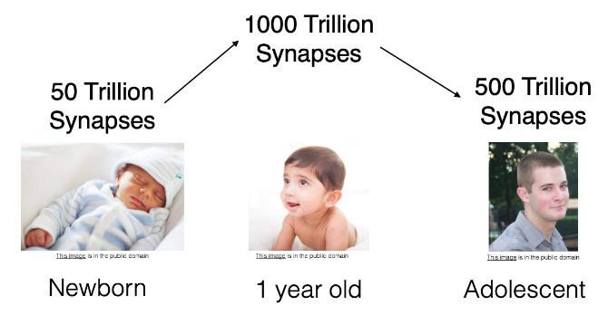

State-of-the-art deep learning techniques rely on over-parametrized models that are hard to deploy.(我们知道自从2012年的AlexNet在ImageNet上取得成功之后，网络就开始朝着越来越深和越来越宽的方向发展，也就是我们经常所说的网络变得越来越大，这是造成过参数化的原因) On the contrary, biological nerual networks are known to use efficient sparse connectivity(这里举的例子是人的孩儿时代，青少年时代，成年时代，我们知道神经网络早期叫perceptron，后来发展到MLP，之后DNN，以及现在的CNN之类，神经网络的灵感来源是人的大脑，而我们人的成长，可以看做是对网络的不断修剪)

对于本课程我们使用的Magnitude-weight Pruning，下面是比较形象的示意图:

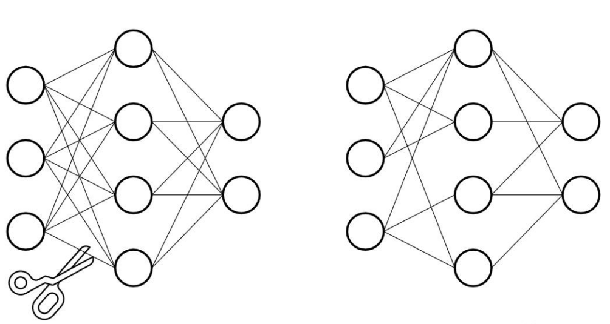

注意这里被剪掉的连接，其实是被置0了，因为0和任何数相乘都是零，也就代表这个被剪掉的连接不起作用了

上一节课我们讲了如何建立DataPipeline，这节课我们来讲讲Model Build和Model train and eval

首先说一下，我们采用的分类网络是VGG16，下图是一个简单的结构展示图

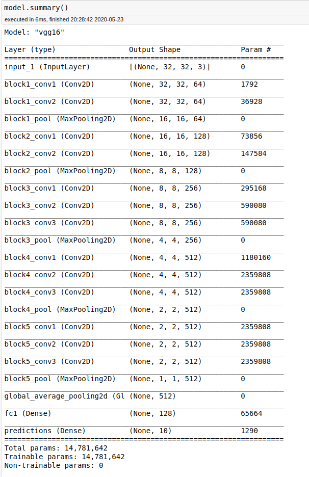

一个分类网络分为两部分，特征提取模块和分类器模块，我们可以发现分类器模块的全连接层被修改过，最后一层的输出神经元个数契合所使用数据集的分类数

接下来我们直接看程序，先说一下大概流程:

1. 训练Baseline Model
2. 对Baseline Model进行Prune，得到Baseline_pruned Model
3. 训练Baseline_pruned Model
4. 对比Baseline Model和Baseline_pruned Model的test acc, model size, inference time

下面是训练结果统计表，**有时间的话完善一下，待填坑**，**构建网络的话可以加入数据增强模块和数据归一化处理和正则化手段，以提高acc**

| 数据集  | 网络架构 | epochs | Baseline testAcc modelSize  inferenceTime | Baseline_pruned testAcc modelSize inferenceTime 80%稀疏度 | train Time(Tesla P100) |
| ------- | -------- | ------ | ----------------------------------------- | --------------------------------------------------------- | ---------------------- |
| cifar10 | VGG16    | 500    | 0.633\|54.98Mib\|7ms/step                 | 0.581\|17.31Mib\|7ms/step                                 | 1.53h                  |
|         |          |        |                                           |                                                           |                        |
|         |          |        |                                           |                                                           |                        |
|         |          |        |                                           |                                                           |                        |

所以我们可以发现，剪枝最主要的目的是进行模型压缩，对于VGG16来说，压缩倍数大概是3x，然后的话准确率会有所下降，推断速度没有提升(如果有特定硬件或者函数库支持稀疏矩阵运算的话，会有提升)

最后的话，再放一篇论文，感兴趣的同学可以去阅读一下，[To prune, or not to prune: exploring the efficacy of pruning for model compression](https://arxiv.org/pdf/1710.01878.pdf)