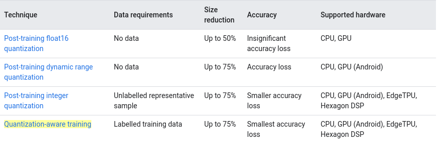
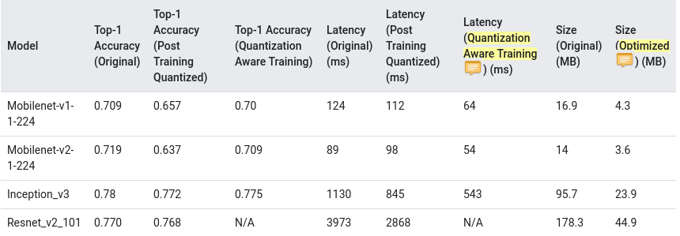
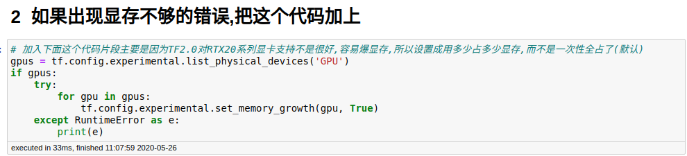
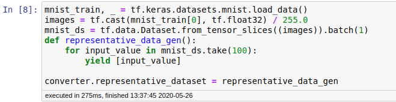
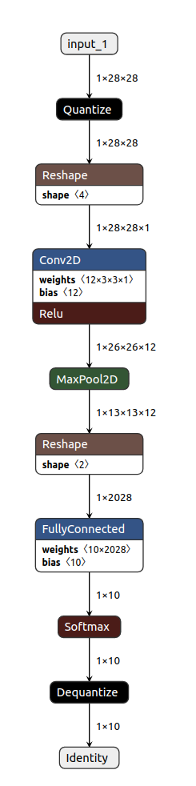
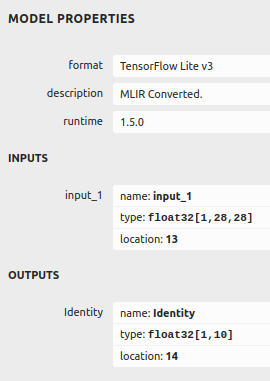
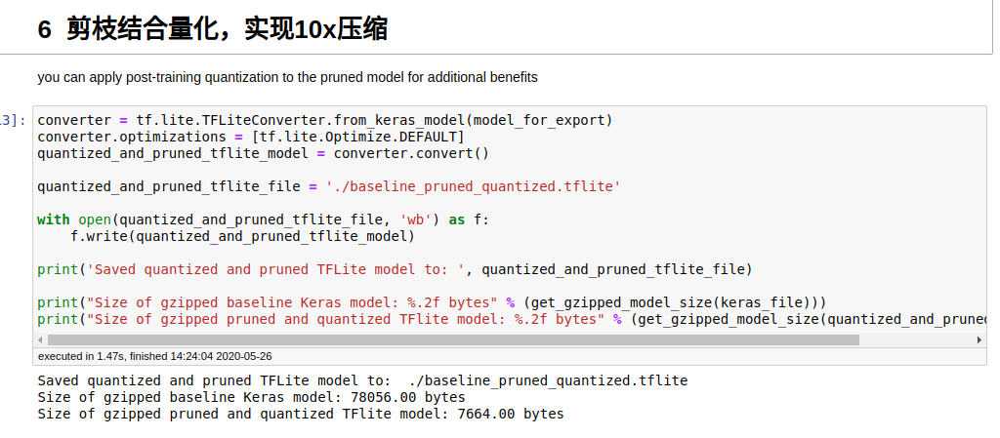

## 为什么需要进行模型量化

**减小模型体积**，以及有以下几点好处:

+ 在设备上的存储体积更小
+ 下载时，所需安装包更小
+ 内存使用更少

**降低推断延迟**

**硬件加速**，比如谷歌的Edge TPU(这里需要用integer quantization，并且输入输出都是int8)

量化主要是通过降低数值精度来做到模型体积压缩以及加速计算，下图是Tensorflow Lite目前支持的量化类型

下图是post-training quantization和quantization-aware training的推断延迟和准确率结果表

本课程主要介绍post-training integer quantization和weight_pruning+post-training weight quantization组合效益

## post-training integer quantization

同时对网络里的weight和activation进行量化

我们直接来看程序吧，如果用的是RTX20系列的显卡，记得加上下图这个代码，防止出现显存不够用的错误

我们来说下大体流程:

1. 定义网络并训练
2. 把model转化成FP32的.tflite
3. 把model转化成INT8的.tflite
4. 比较FP32和INT8两种情形下的.tflite的test acc，model size，inference time

相比于post-training weight quantization，integer quantization多了一个representative_dataset用于做calibration，下面的截图是代码部分

特殊点儿的地方还在于我们可以强制的把输入输出指定成int8，这样就可以在一些edge tpu之类的设备上运行

我们还可以用netron开源工具可视化.tflite模型文件，具体看一下下面这个图

上图是简单网络的网络结构图，其中的输入输出都是fp32，中间网络部分的运算都是Int8，下图是输入输出的一些信息展示

## weight_pruning+post-training weight quantization

weight quantization的话，主要是量化weight，对于activation并没有量化，这里的话，主要是想展示剪枝配合量化之后的模型体积压缩效果

先说一下流程，主要有以下几步:

1. 训练Baseline model
2. 对Baseline model进行prune, 得到Baseline_pruned model
3. 训练Baseline_pruned model
4. 对Baseline_pruned model进行post-training weight quantization, 得到Baseline_pruned_quantized model
5. 对比Baseline, Baseline_pruned, Baseline_pruned_quantized的test acc, model size, elapsed time

最终实现了10x的模型体积压缩，如下图所示

