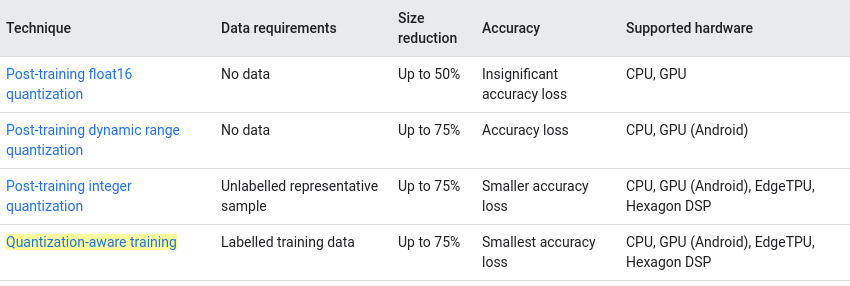
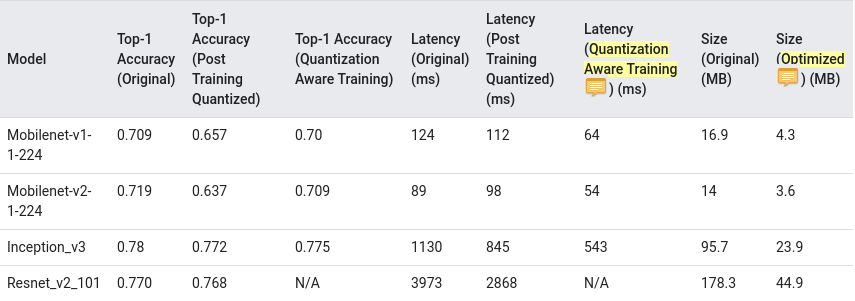
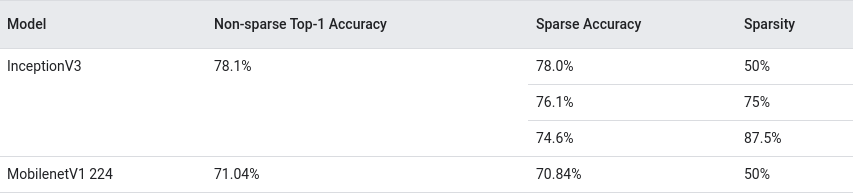

# Model optimization

A toolkit to optimize ML models for deployment for Keras and Tensorflow, including quantization and pruning

Github参考链接:  [tensorflow/model-optimization](https://github.com/tensorflow/model-optimization)

[Tensorflow blog](https://medium.com/tensorflow)

## Why models should be optimized

Computational demand for training grows with the number of models trained on different architectures, whereas the computational demand for inference grows in proportion to the number of users

### Size reduction

+ Smaller storage size: smaller models occupy less storage space on your user's devices. for example, an Android app using a smaller model will take up less storage space on a user's mobile deivce
+ Smaller download size: smaller models require less time and bandwidth to download to user's deivces
+ Less memory usage: smaller models use less RAM when they are run, which frees up memory for other parts of your application to use, and can translate to better performance and stability

Quantization can reduce the size of a model in all of these cases, potentially at the expense of some accuracy. pruning can reduce the size of a model for download by making it more easily compressible

### Latency reduction

Latency is the amount of time it takes to run a single inference with a given model. some forms of optimization can reduce the amount of computation required to run inference using a model, resulting in lower latency. latency can also have an impact on power consumption

Currently, quantization can be used to reduce latency by simplifying the calculations that occur during inference, potentially at the expense of some accuracy

### Accelerator compatibility

Some hardware accelerators, such as Edge TPU, can run inference extremely fast with models that have been correctly optimized

Generally, these types of devices require models to be quantized in a specific way. see each hardware accelerators documentation to learn more about their requirements

## Types of optimization

### Quantization

The following types of quantization are available in Tensorflow Lite:

Below are the latency and accuracy results for post-training quantization and quantization-aware training on a few models. all latency numbers are measured on Pixels 2 deivces using a single big core CPU

### Pruning

Pruning works by removing parameters within a model that have only a minor impact on its predictions. pruned models are the same size on disk, and have the same runtime latency, but can be compressed more effectively. this makes pruning a useful technique for reducing model download size

In the future, Tensorflow Lite will provide latency reduction for pruned models

The models were tested on Imagenet

以上内容参考链接:

+ [Model optimization](https://www.tensorflow.org/lite/performance/model_optimization#quantization)
+ [TensorFlow model optimization](https://www.tensorflow.org/model_optimization/guide)

# Weight pruning

Magnitude-based weight pruning gradually zeroes out model weights during the training process to achieve model sparsity. sparse models are easier to compress, and we can skip the zeroes during inference for latency improvements

This technique brings improvements via model compression. In the future, framework support for this technique will provide latency improvements

For background, see [To prune, or not to prune: exploring the efficacy of pruning for model compression](https://arxiv.org/pdf/1710.01878.pdf)

In this tutorial, you will:

1. Train a tf.keras model for MNIST from scratch
2. Fine tune the model by applying the pruning API and see the accuracy
3. Create 3x smaller TF and TFLite models from pruning
4. Create a 10x TFLite smaller model from combining pruning and post-training quantization
5. See the persistence of accuracy from TF to TFLite

以上内容参考链接:

+ [Trim insignificant weights](https://www.tensorflow.org/model_optimization/guide/pruning)
+ [Pruning in Keras example](https://www.tensorflow.org/model_optimization/guide/pruning/pruning_with_keras)
+ [Pruning comprehensive guide](https://www.tensorflow.org/model_optimization/guide/pruning/comprehensive_guide.md)

