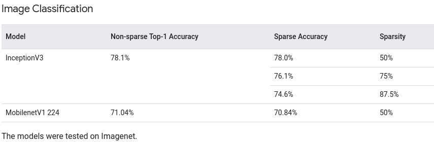
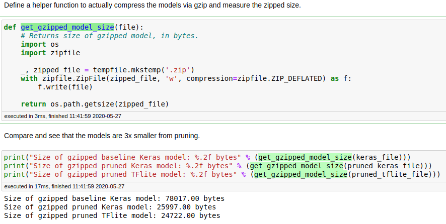
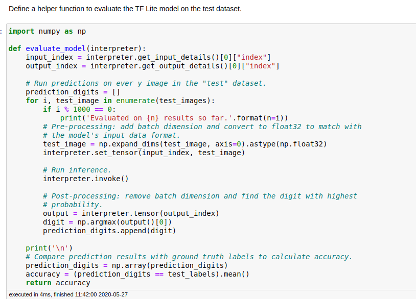
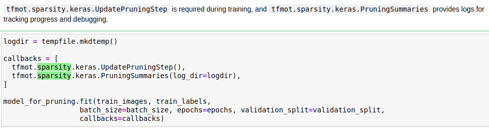
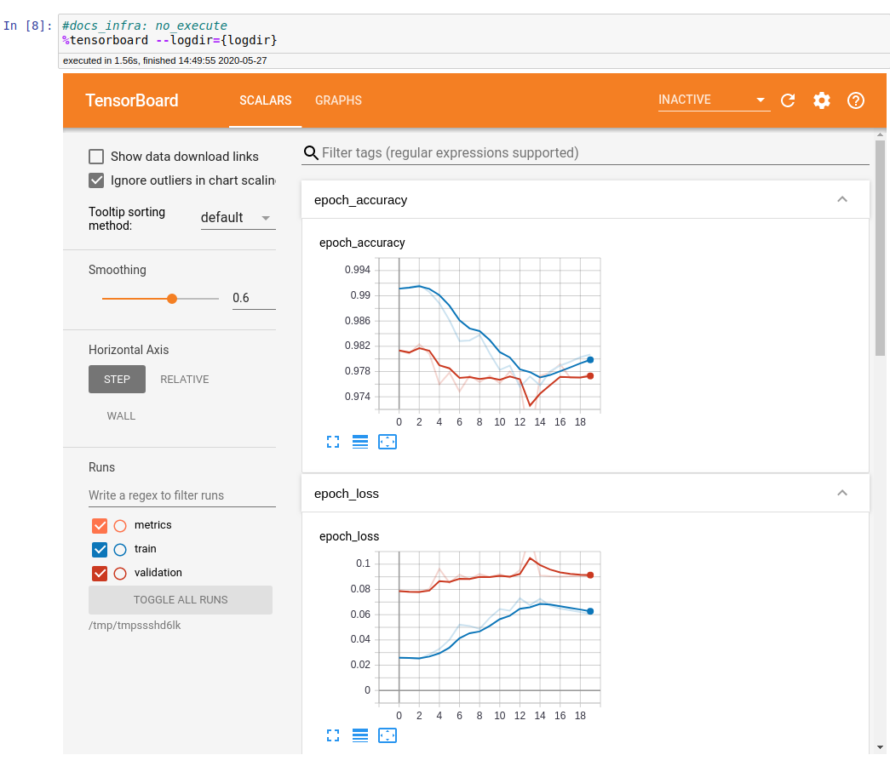
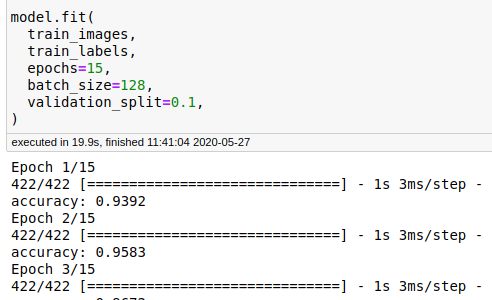
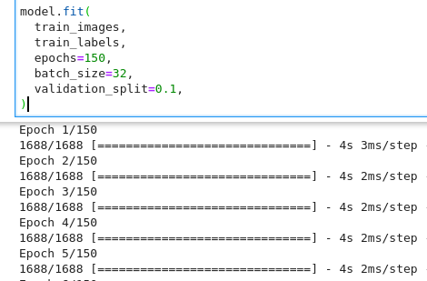
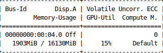
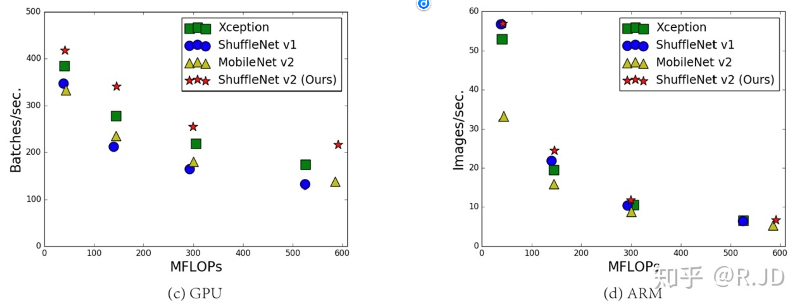
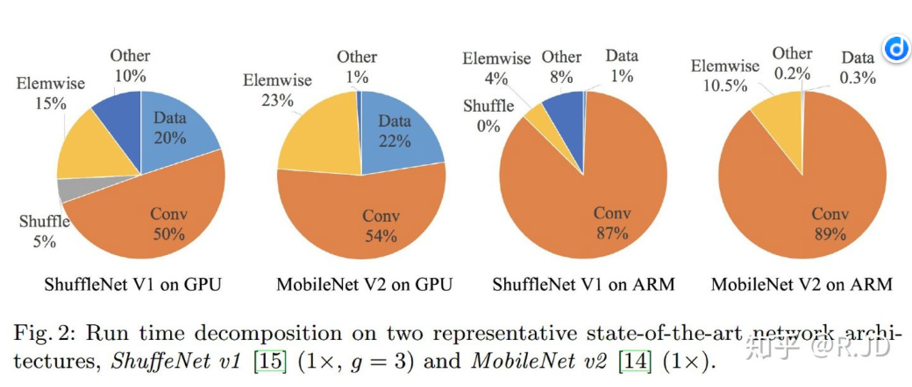

# Pruning

## Trim insignificant weights

[Trim insignificant weights](https://www.tensorflow.org/model_optimization/guide/pruning)

Train a CNN model on the MNIST handwritten digit classification task with pruning: [code](https://github.com/tensorflow/model-optimization/blob/master/tensorflow_model_optimization/python/examples/sparsity/keras/mnist/mnist_cnn.py)

Train a LSTM on the IMDB sentiment classification task with pruning: [code](https://github.com/tensorflow/model-optimization/blob/master/tensorflow_model_optimization/python/examples/sparsity/keras/imdb/imdb_lstm.py)

To prune, or not to prune: exploring the efficacy of pruning for model compression: [paper](https://arxiv.org/pdf/1710.01878.pdf)

​					上图仅供参考，最好还是需要自己再去复现一遍，**待填坑**，**这两个网络看情况吧**

## Pruning in Keras example

[Pruning in Keras example](https://www.tensorflow.org/model_optimization/guide/pruning/pruning_with_keras#see_persistence_of_accuracy_from_tf_to_tflite)

| 数据集 | 模型                                     | 模型体积 | 准确率 |
| ------ | ---------------------------------------- | -------- | ------ |
| mnist  | baseline(简单模型)                       | 1x       | 0.9808 |
| mnist  | baseline_Wpruned(简单模型)               | 3x压缩   | 0.9699 |
| mnist  | baseline_Wpruned_Wquantization(简单模型) | 10x压缩  | 0.9698 |

TF ------>  TFLite    对模型进行量化(quantization)

create sparse models with the TensorFlow Model Optimization Toolkit API for both Tensorflow and TFLite

### 经验总结

代码在**tutorial/tf2_pruning/pruning_with_keras.ipynb**，**这个代码的话得和Magnitude-weightPruning.ipynb进行一下整合**

#### CUDA方面的显存报错，在RTX20系列显卡上

#### 获得模型压缩后的体积大小以及zip文件

#### 定义一个用于评估TFLite模型的函数(这个应该属于量化的)

#### 利用tensorboard可视化每层的稀疏度以及训练的acc和loss

#### 训练的时候batch_size大小适当的话，可以加快训练速度

​										上图的batch_size=128，每个epoch耗时1s

​										上图的batch_size=32，每个epoch耗时4s

这种情况一般是在显卡内存没有打满，GPU使用率没有打满的情况下可以使用，如下图所示

## Pruning comprehensive guide

[Pruning comprehensive guide](https://www.tensorflow.org/model_optimization/guide/pruning/comprehensive_guide)

# Lightweight neural network

初步定的是ShuffleNet和MobileNet

可以从MAC(内存访问成本)

FLOPS(floating point operations per second): 指每秒浮点运算次数，是衡量硬件性能的一个指标

FLOPs(floating point operations): 指浮点运算数，可以用来衡量模型的复杂度. 模型在论文中常用GFLOPs(1 GFLOPs = 10^9 FLOPs)

[CNN模型所需的计算力(FLOPs)和参数量(parameters)是怎么计算的](https://www.zhihu.com/question/65305385)

[torchstat](https://link.zhihu.com/?target=https%3A//github.com/Swall0w/torchstat)，可以用来计算pytorch构建的网络的参数量，体积大小，FLOPs等指标

​				从上图我们可以发现，具有相似的FLOPs的网络，执行的速度缺不一样，所以FLOPs作为计算复杂度的唯一指标是不充分的

原因如下:

(1) FLOPs没有考虑几个对速度有相当大影响的重要因素

+ MAC(内存访问成本)，计算机在进行计算的时候要先加载到缓存中，这个加载过程是需要时间的. 其中分组卷积(Group convolution)是对MAC消耗较多的操作
+ 并行度，在相同FLOPs下，具有高并行度的模型可能比具有低并行度的另一个模型快得多

(2) 计算平台的不用

不同的运行平台，得到的FLOPs也不相同. 有的平台会对操作进行优化，比如: cudnn加强了对3x3 conv计算的优化. 这样一来，不用平台的FLOPs大小确实没有什么说服力

通过以上的分析，作者提出了2个网络执行效率对比的设计准则:

1. 使用直接度量的方式如速度代替FLOPs
2. 要在目标计算平台上计算，不然结果不具有代表性

​			可以看到，整个运行时被分解用于不同的操作. 处理器在运算的时候，不光只是进行卷积运算，也在进行其它的运算，特别是在GPU上，卷积运算只占了运算时间的一半左右

​			我们将卷积部分认为是FLOPs操作. 虽然这部分消耗的时间最多，但其它操作包括数据IO，数据Shuffle和Elementwise操作也占用了相当多的时间. 因此，再次确认了模型使用FLOPs指标对实际运行时间的估计不够准确

四个高效的设计指南:

1. 输入输出具有相同channel的时候，内存消耗最小
2. 过多的分组卷积操作会增大MAC，从而使模型速度变慢
3. 模型中的分支数量越少，模型速度越快
4. Element-wise操作不能被忽略(Add/Relu/short-cut/depthwise convolution等等)

元素操作类型虽然FLOPs非常低，但是带来的时间消耗还是非常明显的，尤其是在GPU上

参考链接: 

+ [轻量级神经网络(一)--ShuffleNetV2](https://zhuanlan.zhihu.com/p/67009992)
+ [MobileNetv1~v3, ShuffleNet等轻量级网络](https://cygao.xyz/2019/07/12/lightweight/)
+ [轻量级神经网络(二)--MobileNetv1~v3](https://zhuanlan.zhihu.com/p/70703846)
+ [精简网络模型(一)](https://zhuanlan.zhihu.com/p/65998279)
+ [精简CNN模型以ShuffleNetv2为例子解释, 移动端网络设计的需要的规则ARM、GPU上对比, 各种卷积方式的演变跟介绍](https://blog.csdn.net/yangdashi888/article/details/87912600)
+ [精简网络模型(二)](https://zhuanlan.zhihu.com/p/66230470)

